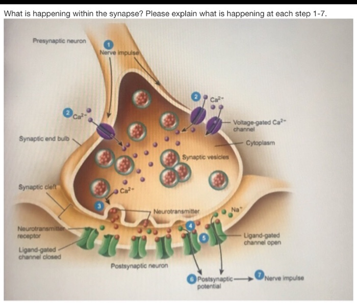
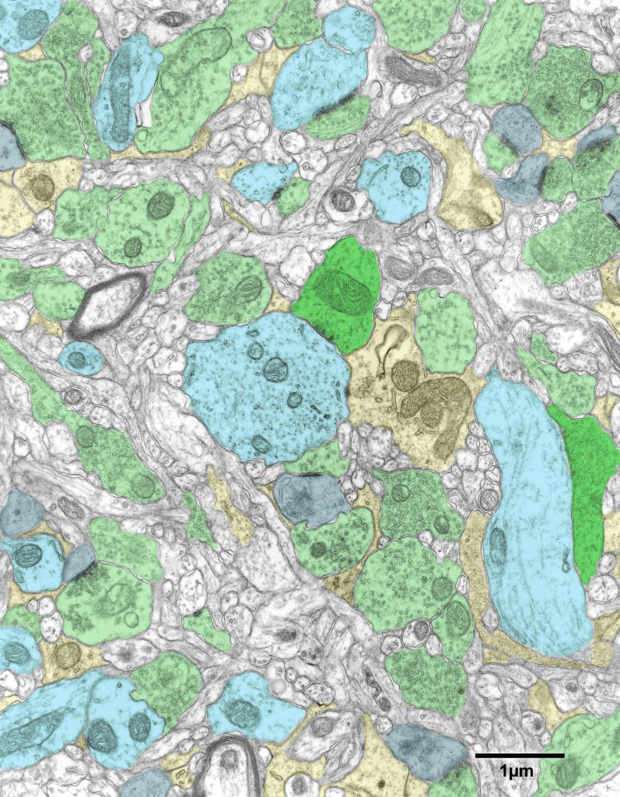

# Brain

## Structure
consists of neuronal cells, which can be classified as:
* pre-synaptic
* post-synaptic

$$ y \approx f(x) $$

Pre-Synaptic Neurons

Answer Key:
In the nervous system, a synapse is a structure that permits a neuron (or nerve cell) to pass an electrical or chemical signal to another neuron. Steps which occurs within a synapse are as follows:
- Action potential reaches the presynaptic terminal
- Depolarization of the pre-synaptic terminal opens ion channels  allowing the calcium ions inside the cell.
- Calcium ions triggers release of neurotransmitter from vesicles
- Neurotransmitter binds to receptor site in postsynaptic membrane.
- Opening and closing of ion channels causes change in post-synaptic membrane potential
- Action potential propagates through the next cell
Neurotransmitter is inactivated or transported back into presynaptic terminal

On a different dimension, neurons can be classified as:
* symmetric
* assymmetric

dendritic spines (Gray) and shafts (blue), symmetric inhibitory synapse (dark green)

