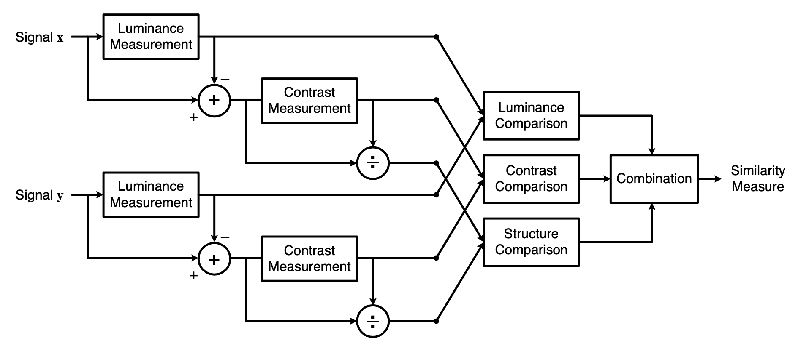
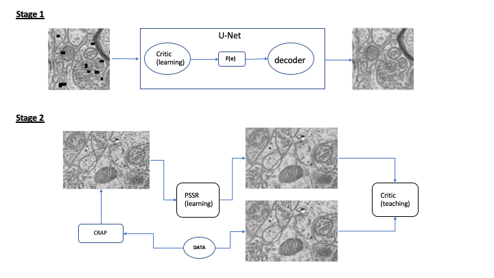

# Methods
The following should contain information about the methods used in our experiments as part of the Salk-WAMRI practicum 2019-2020. 

## Loss Functions
In our experiments, loss functions are used to compute single-valued error between the target image and the model's prediction. These errors are used to optimize the model's parameters with the aim to facilitate learning the underlying task via the backpropagation algorithm. In our case, the underlying task is the de-crappification of electron microscopy images of brain tissue samples. The following subsections should contain brief definitions of the loss functions used in our experiments. 

### Mean Squared Error
The mean squared error (MSE) loss function computes the average pixel-wise squared differences between the target and predicted images. This can be expressed mathematically as:

$$ L_{MSE}(y , \hat{y}) = \frac{1}{mn} \sum \limits_{i=1}^{m} \sum \limits_{j=1}^{n} (y_{ij} - \hat{y}_{ij})^2 $$
where $y$ and $\hat{y}$ denote the target and predicted images, respectively; $m$ and $n$ denote the height and widths of the images, respectively; and $y_{ij}$ and $\hat{y}_{ij}$ denote the target and predicted pixel values in the $ij$-th coordinate, respectively. 

### Structural Similarity Index
The structural similarity index (SSIM) is a perceptual quality assessment measure between two images based on the degradation of structural information. SSIM compares local patterns of pixel intesnities that are normalized for luminance and contrast [1]. This metric can be expressed as:

In our work, we use the negative logarithm of SSIM (NLSSIM) as a loss function. Results showed that applying the negative logarithm allowed improved model convergence, better error-value interpretability, and greater usability in combined loss functions (discussed later). 

### Feature Loss
The feature loss is another perceptual loss function that uses a secondary neural network model, hereafter be known as a critic, to compute the error between the target and predicted images. This was first introduced in [2] where the critic was a neural network that was trained on the imagenet classification task. In our work, we use a critic that is trained on an in-painting pretext task using self-supervised learning. We later show that using the latter critic for feature loss leads to improved performance of the PSSR (denoising) model when compared to a critic that is just trained on the imagenet classification task. 

More specifically, we train a U-Net on the in-painting task. Afterwards we use the encoder part of the U-Net (ResNet34) as our critic model for feature loss (see diagram below).

# References
[1] Wang, Z., Bovik, A.C., Sheikh, H.R. and Simoncelli, E.P., 2004. Image quality assessment: from error visibility to structural similarity. IEEE transactions on image processing, 13(4), pp.600-612.